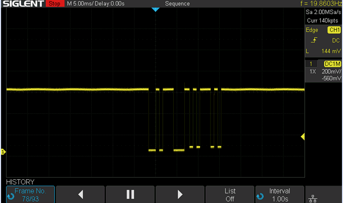

This component is meant for garage door openers that support Security+ and
have the [889LM](https://www.amazon.com/gp/product/B07ZTRG8ML) wall button.
These openers typically have purple, red, or orange "Learn" buttons. When
connected to the [889LM](https://www.amazon.com/gp/product/B07ZTRG8ML) wall
button, the opener and button communicate via a request/response-style
serial protocol.

Note: This likely won't work for newer `Security+ 2.0` garage doors. This also
doesn't work with the 41a5273-1 wall button. Those communicate
[differently](https://electronics.stackexchange.com/questions/141076/what-is-the-name-of-the-protocols-used-to-let-an-automatic-garage-door-opener/279059#279059).
If you have one of these, and your opener has the purple, red, or orange
"Learn" buttons, then you should be able to easily upgrade to the
[889LM](https://www.amazon.com/gp/product/B07ZTRG8ML) button, which will then
allow for monitoring via the serial interface.

An ESP32 can be attached in parallel with the existing wires between the
opener and the 889LM wall button. This allows for watching the communications
and the ability to inject requests. By injecting requests onto the serial bus,
the door, light, and lock state can be toggled. The current state of the
opener can be determined by watching the exising status messages that are
transmitted between the button and opener. This allows for reading the
following state:

* Door state: open, opening, closing, closed, stopped.
* Light state: on, off
* Eye sensor state: clear, blocked
* Lock state (remote lock-out): locked, unlocked

See the [garagedoor.yaml](garagedoor.yaml) file for an example of how to use
this component.

# Decode circuit

It is necessary to shift the signal voltage levels between the garage door and
the ESP32. Here's an example schematic for interfacing with the serial data.
The schematic assumes that the `+7v` & `Gnd` terminals (left side) are
connected to the coorsponding terminals on the back of the garage door opener;
in parallel with the wires for the wall button.

When the garage door opener is connected to the 889LM wall button, the voltage
is around 7v. When not connected to the wall button, the voltage can go up to
24v. This circuit should handle both voltages. The code for the component,
however, expects that the 889LM wall button is connected.

# Connecting to the garage door

On the left side of the schematic is a `+7v` & `Gnd` terminal block. Use a wire to connect the `+7v` terminal to the positive wall button terminal on the opener. Connect the `Gnd` to the common terminal on the opener.

# Serial decode notes

Baud(1200), Parity(Even), StopBits(1)

| Desc | 1 (Eye Sensor) | 2 (Light) | 3 (Door) | 4 (Light) |
|------|----------------|-----------|----------|-----------|
|Door(Closed) Light(On)|0x39 0x00|0x3a 0x5d|0x38 0x55|0x3a 0x5d|
|Door(Closed) Light(Off)|0x39 0x00|0x3a 0x59|0x38 0x55|0x3a 0x59|
|Door(Open) Light(On)|0x39 0x00|0x3a 0x5d|0x38 0x52|0x3a 0x5d|

The first byte is sent as a request from the wall button. The second byte is sent in response by the garage door opener.

* Toggle door: 0x30 0x31 0x31
* Toggle light: 0x32 0x33 0x33
* Toggle lock: 0x34 0x35 0x35
